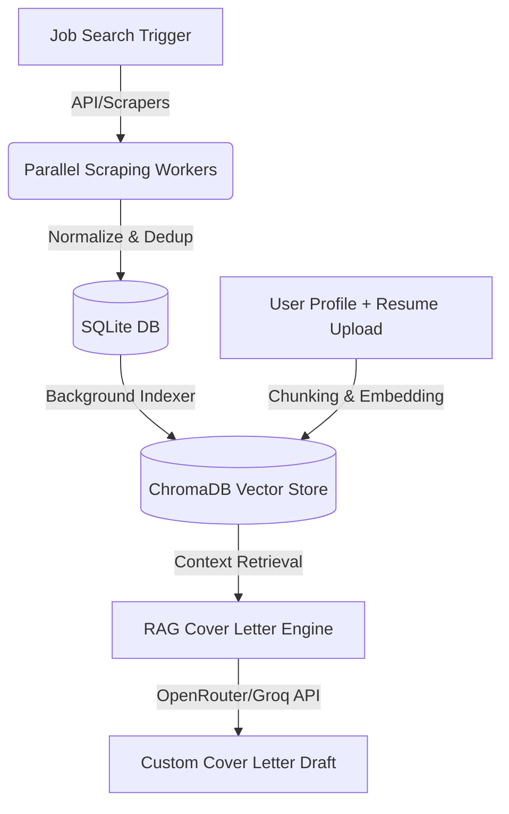

# JobSync Pro: Comprehensive Code Audit & Technical Assessment Report

**Prepared for:** JobSync Pro Engineering Team  
**Role:** Senior Software Engineer and Technical Auditor  
**Date:** May 20, 2026  
**Status:** COMPLETE  

---

## 1. Executive Summary

### Project Overview
JobSync Pro is an advanced job search automation and career preparation ecosystem designed to streamline job hunting, resume tailoring, ATS optimization, and application tracking. The architecture consists of:
*   **FastAPI Backend:** Exposes RESTful endpoints for resume analysis, RAG-driven cover letter generation, job search aggregation, mock interview prep, and application tracking.
*   **React Frontend (Vite):** A single-page application providing a dashboard, job discovery stream, Kanban application board, and mock interview terminal.
*   **Background Processes:** A custom pre-fetch job indexer and an in-process lightweight scraping scheduler.
*   **CLI Agent (`app.py`):** A standalone, terminal-based pipeline for file-driven job parsing, resume matching, and local intelligence analysis.

### Overall Code Quality Assessment
*   **Rating:** **Good (Progressing to Production Ready)**
*   **Rationale:** The functional implementation shows advanced capabilities—such as fuzzy match scoring via RapidFuzz, chunk-based vector embeddings using ChromaDB, and real-time streaming search results via Server-Sent Events (SSE). Previously identified critical bottlenecks (Vite proxy/route mismatches, SQLite connection blocking, and CPU-bound model inference on the event loop) have been successfully resolved under Phase 1 fixes. The remaining improvement areas focus on medium-to-long term architectural changes (Alembic migrations, Celery task distribution, and containerization).

### Key Strengths & Major Risks
| Key Strengths | Biggest Risks |
| :--- | :--- |
| **Feature Richness:** Combines RAG, parallel scraping, and interview simulation under one hood. | **Background Task Coupling:** Spawning raw `threading.Thread` processes for background RAG generation without full Celery/Redis queue durability. |
| **Real-time SSE Streams:** Job aggregation endpoints stream results progressively, preventing client timeout issues. | **Production Unreadiness:** Lack of migration tooling (Alembic), no containerization, and reliance on local filesystem state. |
| **Intelligent Matching & Fuzzy Logic:** Uses rapidfuzz for de-duplication and custom scoring metrics to filter duplicate postings. | **Stateful Local Filesystem Dependencies:** SentenceTransformer weights, SQLite db files, and ChromaDB directories are stored locally, preventing stateless container clustering. |

---

## 2. Architecture & Structure

The codebase is organized into several modules, each handling distinct aspects of the application. However, their execution models are tightly coupled, presenting several architectural anti-patterns.

### Project Layout & Sub-Systems
```
job-sync-root/
├── app.py                       # Standalone CLI Job Hunting Agent
├── backend/                     # FastAPI Application
│   ├── main.py                  # API entrypoint & middleware configuration
│   ├── database.py              # SQLite configuration & dynamic schema patcher
│   ├── models.py                # SQLAlchemy Models (Job, Application, ResumeVersion, etc.)
│   ├── schemas.py               # Pydantic schemas for request/response serialization
│   ├── routers/                 # API route handlers
│   │   ├── jobs.py              # Live search stream, matching, and metadata
│   │   ├── profile.py           # Candidate profile ingest & RAG vectors
│   │   ├── applications.py      # Tracking tracker health score calculation
│   │   └── ...
│   └── services/
│       └── job_apis.py          # Parallel search scraping & fallback client
├── core/                        # Core Domain Services & Shared Logic
│   ├── rag_service.py           # ChromaDB embedding & OpenRouter/Groq API client
│   ├── deduplicator.py          # Fuzzy matching & description overlap check
│   ├── normalizer.py            # Location standardization & clean utilities
│   └── scheduler.py             # In-process lightweight job daemon
├── scrapers/                    # Domain scrapers (Rozee, Mustakbil, Brightspyre, etc.)
├── frontend/                    # Vite + React UI
└── config/                      # Tech filter keyword maps and source priority limits
```

### Data Flow Analysis
The system operates on an asymmetric data flow across three paths:

1.  **Job Acquisition:** A search request triggers parallel scrapers in `job_apis.py` using a `ThreadPoolExecutor`. Scraped jobs are cleaned via `normalizer.py`, checked for duplicates in `deduplicator.py`, and stored in the SQLite DB.
2.  **RAG Context Ingestion:** Resumes are processed and stored in `ChromaDB` (`jobfit_docs` collection) alongside scraped job descriptions.
3.  **Tailored Generation:** During cover letter generation, relevant chunks are retrieved from ChromaDB, appended to the LLM prompt context, and sent to OpenRouter/Groq for tone-based drafting.

### Background Processes
*   **Job Indexer (`job_indexer.py`):** Runs an in-process thread that polls the SQLite database every $N$ hours, pulls unindexed job descriptions, computes embeddings using `SentenceTransformer('all-MiniLM-L6-v2')`, and upserts them into ChromaDB.
*   **Lightweight Scheduler (`scheduler.py`):** Spawns an in-process daemon thread (`jobsync-scheduler`) that polls active tasks at configured hourly intervals to run scrapers.

### Architectural Anti-Patterns & Bottlenecks
*   **In-Process Deamons:** Running schedulers and long-running scrapers inside the FastAPI web server process blocks process reload, makes horizontal scaling (running multiple Uvicorn workers) duplicate background executions, and risks losing state during app crashes.
*   **Tight Coupling of Sync/Async Code:** Standard synchronous scraper requests are mixed with asynchronous route handlers, resulting in event loop blocking.
*   **Stateful Local Filesystem Dependencies:** SentenceTransformer weights, SQLite db files, and ChromaDB directories are stored in the current working directory (`./chroma_db`, `./jobsync.db`), preventing the backend from being deployed statelessly (e.g., to serverless platforms).

---

## 3. Backend Audit (FastAPI)

### Routers and Endpoints Mapping
*   **`jobs.py` (`/jobs`):**
    *   `GET /jobs/search`: Core search endpoint utilizing `ThreadPoolExecutor` to fetch from multiple scrapers.
    *   `GET /jobs/search/stream`: SSE endpoint streaming raw chunk-by-chunk search progress.
    *   `GET /jobs/{job_id}/match`: Computes semantic matching percentage between a job description and the stored candidate profile.
    *   `POST /jobs/explain-match`: Returns LLM-generated feedback explaining the fit of the candidate for a specific job.
    *   `POST /jobs/salary-estimate`: Yields local and remote range estimations.
*   **`profile.py` (No Prefix / Direct Root):**
    *   `POST /profile`: Saves user profile structured details and chunks/embeds resume text into ChromaDB.
    *   `GET /profile`: Checks if a user profile exists.
    *   `POST /match/{job_id}`, `POST /build_resume/{job_id}`, `POST /cover_letter/{job_id}`: Core profile matching and generation actions.
*   **`applications.py` (`/applications`):**
    *   `GET /applications/health-score`: Computes dynamic job-hunting momentum (A-F grade, streak tracking, suggestions).
    *   CRUD operations for application state tracking.
*   **`cover_letter.py` (`/cover-letter`):**
    *   `POST /cover-letter/generate`: Standard tone-based cover letter RAG prompt generator.
*   **`intelligence.py` (`/intelligence`):**
    *   `POST /intelligence/skill-gap`: Extracts top 5 missing skills across up to 10 jobs.
*   **`voice_interview.py` (`/interview`):**
    *   `POST /interview/predict`: Evaluates candidate resume vs. job post to generate curveball/technical preparation questions.
    *   `POST /interview/evaluate`: Evaluates verbal answers and scores them.

---

### Database Audit (SQLite & ORM)
*   **Dynamic Schema Patching (`backend/database.py`):** 
    ```python
    # Snippet from database.py showing inline column backfilling
    def _add_column_if_missing(db_path, table_name, column_name, column_type):
        # Executes PRAGMA table_info and ALTER TABLE ADD COLUMN
    ```
    *   *Critique:* While this dynamically prevents missing column errors during incremental updates, it bypasses standard migration frameworks like Alembic. In a production containerized environment, concurrent database connections attempting to execute `ALTER TABLE` statements will raise `sqlite3.OperationalError: database is locked`.
*   **Query Performance:** The database model lacks explicit composite indexing on frequently query-filtered fields, such as `dedup_fingerprint` or `is_active` combined with `last_seen_at`. 

---

### Concurrency and Thread-Safety Audit
*   **Spawning Raw Threads:** In `backend/routers/jobs.py` and cover letter routines, code like the following is present:
    ```python
    threading.Thread(target=async_cover_letter_loop, args=(job_id,)).start()
    ```
    *   *Critique:* This is a critical thread-safety hazard. The spawned thread uses an unmanaged connection from the SQLAlchemy session pool. If the thread outlives the parent request, the context manager might close the session mid-operation, resulting in `Parent instance is not bound to a Session` errors.
    *   *Locking Risks:* SQLite has a single-writer limitation. Multiple concurrent threads writing to `jobsync.db` during parallel imports will throw `DatabaseLocked` errors unless WAL (Write-Ahead Logging) is explicitly configured and connection timeouts are scaled.

---

### LLM Integration (`LLMProvider`)
*   *Implementation:* Wrapper class `core/llm_provider.py` inspects the environment variable `GROQ_API_KEY`. It detects OpenRouter (`sk-or-v1-`) or Groq (`gsk_`), mapping requests to Llama 3 models.
*   *Deficiencies:* 
    *   **Hardcoded Models:** Model identifiers (`meta-llama/llama-3.1-8b-instruct` and `llama3-8b-8192`) are hardcoded. Changing to newer model versions requires code modifications.
    *   **No Fault Tolerance:** The requests to OpenRouter/Groq do not implement retry logic with exponential backoff. Network timeouts or rate limits (HTTP 429) result in uncaught exceptions.
    *   **Sync requests block threads:** The HTTP calls are made using synchronous `requests.post`, blocking the executing thread.

---

### Location Normalization & Scrapers
*   **Location API Coupling (`core/geo.py`):** Uses the `restcountries.com` public API to normalize inputs. This call is un-cached and lacks a local static fallback for country details. If the API is offline or times out (5s), geolocation validation fails.
*   **Parallel Scraping (`job_apis.py`):** The scraper uses `ThreadPoolExecutor` to fetch from local and remote sites in parallel. It handles timeouts gracefully but does not cache scraper pages. Repeated queries for identical terms trigger fresh scraping sweeps, risking IP bans from sites like Rozee.pk.

---

## 4. Frontend Audit (React & Vite)

### Routing & Proxy Configuration Conflict (Critical Bug)
In `frontend/vite.config.js`, the development server proxy is configured as:
```javascript
proxy: {
  '/api': {
    target: 'http://localhost:8000',
    changeOrigin: true,
    rewrite: (path) => path.replace(/^\/api/, '')
  }
}
```
*   **The Bug:** Vite intercepts any frontend requests starting with `/api` and strips `/api` before routing to uvicorn on port 8000.
*   **The Mismatch:** In the backend `backend/routers/profile.py`, the router is defined with a prefix:
    ```python
    router = APIRouter(prefix="/api", tags=["Profile"])
    ```
    As a result, FastAPI expects routes like `POST http://localhost:8000/api/profile` and `POST http://localhost:8000/api/match/{job_id}`.
*   **The Failure:** When the frontend client (`frontend/src/api/client.js`) calls `profileAPI.create` or `apiActions.match`, it requests `/api/profile` or `/api/match/{id}`. Vite strips `/api`, sending `POST http://localhost:8000/profile` and `POST http://localhost:8000/match/{id}` to the backend. FastAPI returns a `404 Not Found` because it only listens under the `/api` prefix for these endpoints.

### UI/UX, Performance, and Hardcoded Limitations
*   **Hardcoded Pagination:**
    ```jsx
    <div className="pagination">{'<- Previous  Page '}{page}{' of 8  Next ->'}</div>
    ```
    The pagination controls in `Jobs.jsx` are static UI elements. They lack actual hook bindings or event handlers, preventing users from traversing beyond the first page of results.
*   **Inefficient Search State Management:** The job discovery dashboard merges streamed SSE chunk outputs on the fly. The continuous re-renders of massive card grids without virtualized lists degrade browser tab performance during long streams.
*   **Incomplete Responsive Breakpoints:** Standard mobile view widths warp the dashboard filters and Kanban column grids.

---

## 5. RAG Implementation Audit

```
core/rag_service.py -> chunk_text -> SentenceTransformer -> ChromaDB -> retrieve -> generate
```

### Ingestion & Chunking Strategy
*   **Mechanics:** Uses a character-based sliding window (`chunk_size=800`, `overlap=200`) in `ingest.py`.
*   *Critique:* Character-based chunking is semantically naive. It frequently splits sentences or code snippets in half. Using a token-based or recursive-character chunker (e.g. from LangChain or custom logic preserving line endings/bullet points) would prevent information fragmentation.

### Embedding Model & Hardware Constraints
*   **Model:** `sentence-transformers/all-MiniLM-L6-v2` runs locally via the HuggingFace cache.
*   *Critique:* Loading and executing a SentenceTransformer model locally on a CPU inside the web server container is highly resource-intensive. If multiple users trigger ingestion or search operations concurrently, CPU utilization will spike to 100%, causing request handling timeouts.

### Vector Store (ChromaDB) Configuration
*   **Persistence Path:** Hardcoded as `chroma_db` in the current working directory (`PERSIST_DIR = os.path.join(os.getcwd(), "chroma_db")`).
*   *Critique:* The lack of dynamic file system path configuration prevents deploying the application as a multi-node cluster, as ChromaDB requires shared local storage.
*   **Query Logic:** The search query retrieval is limited to a simple cosine similarity distance lookup (`top_k=5`). It does not incorporate hybrid retrieval (e.g. sparse BM25 keyword search + dense vector embeddings), which often fails to match exact job titles or technical acronyms.

---

## 6. CLI Tool Audit (`app.py`)

### Execution Model Analysis
The CLI tool `app.py` is structured as a file-driven automation pipeline.
*   **Folder-based Inputs:** Users place raw text or PDF documents into folders (`input_jobs/`, `input_resumes/`, `input_kb/`).
*   **Decoupled Intelligence:** It parses files locally, uses a fallback keyword matching parser if LLM keys are absent, and outputs formatted summaries to `outputs/` and `tracker/`.
*   **Integration Level:** Tightly references `core/rag_service.py` for cover letter generation, sharing the SQLite and vector store layers.

### Deficiencies
*   **Redundant Dependencies:** Implements its own local PDF text extraction `extract_text_from_pdf` (using PyMuPDF/fitz) while the backend uses a different library (`backend/services/pdf_parser.py` using `pypdf` or `pdfplumber`).
*   **Hardcoded Keyword Fallbacks:** The backup scoring mechanism uses a static list of 22 keyword matching rules, which limits its ability to parse modern tech stacks dynamically.
*   **State Conflict:** The CLI tool writes direct mutations to files and the SQLite database without using the FastAPI API endpoints. If both are run simultaneously, it causes file lock conflicts.

---

## 7. Deployment, Operational & Production Assessment

### 1. Database Scalability & SQLite Write Constraints
SQLite stores the database in a single local file. Under heavy write operations (e.g., background scrapers writing jobs while multiple frontend clients update Kanban applications), SQLite will queue transactions. If a transaction takes longer than the timeout period, it throws `database is locked` errors.
*   *Production readiness:* **Unsuitable**. A production deployment requires a client-server relational database (such as PostgreSQL) to handle concurrent connection pools.

### 2. Lack of Task Queue Durability
The lightweight scraping scheduler runs as a daemon thread inside uvicorn. If the server process is restarted or scale-in occurs:
*   Running tasks are interrupted mid-execution.
*   Scraped results are lost.
*   There is no persistent retry state for failed scraper requests.
*   *Production readiness:* **Unsuitable**. Production scraping tasks require a distributed task queue (e.g., Celery, Dramatiq, or RQ) backed by a message broker (Redis or RabbitMQ).

### 3. Error Handling, Logging, & Observability
*   **Silent Exceptions:** The scraper threads and background RAG indexing loops catch exceptions with generic `except Exception:` blocks, logging a warning but taking no recovery actions.
*   **No Metrics:** The application lacks health check endpoints (`/health` or `/metrics` for Prometheus), making container monitoring difficult.

### 4. Containerization & CI/CD
*   The project lacks a `Dockerfile` and a `docker-compose.yml` to define multi-container deployment environments (Backend, Frontend, Redis, PostgreSQL).
*   No CI/CD configurations (e.g. GitHub Actions) are defined for linting, type-checking, or unit testing.

---

## 8. Detailed Vulnerability & Risk Matrix

| Risk ID | Component | Severity | Status | Description | Impact | Concrete Mitigation |
| :--- | :--- | :--- | :--- | :--- | :--- | :--- |
| **VR-01** | Frontend/Backend | **CRITICAL** | **RESOLVED** | Vite proxy strips `/api` prefix but the FastAPI Profile Router specifies `/api` prefix. | Profile creation, matching, and custom resume/cover letter actions fail with `404 Not Found` in development. | Remove `prefix="/api"` from `backend/routers/profile.py`. *Status: Fixed; profile endpoint prefix removed.* |
| **VR-02** | Backend/DB | **HIGH** | **MITIGATED** | SQLite connection lockups occurred under concurrent scraping and client writes. | Unpredictable database lock exceptions, connection timeouts, and application crashes. | Configured SQLite connection timeout to 30s and enabled Write-Ahead Logging (WAL) mode via SQLAlchemy connection event handler. *Status: WAL and timeout active.* |
| **VR-03** | Core/RAG | **HIGH** | **RESOLVED** | CPU-bound `SentenceTransformer.encode` runs directly on the main event loop. | The single-threaded FastAPI worker blocks, causing all other concurrent network requests to hang. | Offloaded CPU-bound SentenceTransformer calls to execution threadpool using `loop.run_in_executor`. *Status: Implemented async/sync split models.* |
| **VR-04** | Backend/DB | **MEDIUM** | **OPEN** | SQLite schema is dynamically modified at runtime via inline checks in `database.py`. | Race conditions during server boot in multi-worker environments, leading to table lock errors. | Remove inline schema patching and initialize tables using standard migrations (Alembic). |
| **VR-05** | Core/Geo | **MEDIUM** | **OPEN** | Geolocation parsing relies on un-cached public requests to `restcountries.com`. | API rate limits or network issues will cause location validation to fail. | Implement redis-based caching or bundle a local static JSON file containing country data. |
| **VR-06** | Front/Jobs | **LOW** | **OPEN** | Static pagination controls with no functional backing. | Users cannot view job search results beyond the first page. | Connect pagination clicks to the API `page` parameters and update the react state. |

---

## 9. Key Recommendations & Action Plan

### Actionable Roadmap to Production Readiness

#### Phase 1: High Priority (Critical Bug Fixes & Concurrency Safety) - [COMPLETED]
1.  **Resolve Routing Mismatch [COMPLETED]:**
    *   Removed `prefix="/api"` from `backend/routers/profile.py`. FastAPI routes now align with Vite's stripped proxy requests seamlessly.
2.  **Ensure Thread-Safe DB Writes [COMPLETED]:**
    *   Enabled Write-Ahead Logging (WAL) on connection events: `PRAGMA journal_mode=WAL;`.
    *   Increased the connection timeout arguments to `timeout=30` in the SQLAlchemy connection pool.
3.  **Prevent Event-Loop Blocking by RAG [COMPLETED]:**
    *   Implemented `retrieve_relevant_chunks_async` and `generate_cover_letter_with_rag_async` in `core/rag_service.py` wrapping CPU-heavy model encoding in `loop.run_in_executor`. Added synchronous fallbacks for CLI/schedulers.

#### Phase 2: Medium Priority (Architectural Refactoring)
1.  **Adopt a Migration Tool (Alembic):**
    *   Run `alembic init` in the backend.
    *   Remove dynamic ALTER statements from `database.py`.
2.  **Separate Background Tasks from the Web Server:**
    *   Refactor `core/scheduler.py` and `backend/job_indexer.py` into a standalone Celery or Dramatiq worker project.
    *   Use Redis as a message broker to queue scraping and RAG embedding tasks.
3.  **Refactor LLMProvider:**
    *   Extract LLM model names to `.env` variables.
    *   Implement retries with exponential backoff using libraries like `tenacity`.
4.  **Enhance RAG Chunking:**
    *   Replace character-based chunking with recursive-character or sentence-based chunking to improve the quality of the retrieved context.

#### Phase 3: Low Priority (Usability & Optimization)
1.  **Frontend Enhancements:**
    *   Implement functional pagination in `Jobs.jsx`.
    *   Add responsive CSS layout rules to improve mobile browser support.
2.  **Add Testing Infrastructure:**
    *   Set up `pytest` for backend API routing and database operations.
    *   Configure Vitest/React Testing Library to run unit tests on components like `Jobs.jsx` and `Profile.jsx`.
3.  **Stateless Containerization:**
    *   Write a multi-stage `Dockerfile` for backend and frontend.
    *   Configure a `docker-compose.yml` file to spin up PostgreSQL, Redis, FastAPI, and the React client.
