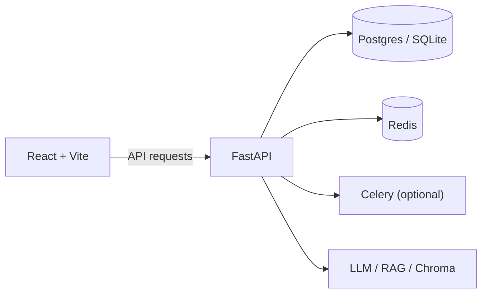

# JobSync Pro

> AI-powered job discovery, tailored application generation, and application tracking.

JobSync Pro is a developer-first job search and application assistant combining multi-source job discovery, profile-aware matching, tailored resume and cover-letter generation, application tracking (Kanban), and operational automation. The project is implemented as a FastAPI backend and a React + Vite frontend.

---

## What it does

- Job search: multi-source ingestion and normalization (scrapers and indexed sources). Jobs are sourced from configured scrapers and indexed feeds, normalized into a common schema and presented via the API.
- Profile-aware matching: extract skills and profile attributes, compute content-based match scores, and optionally rerank with a cross-encoder when enabled.
- Tailored resume generation: hybrid blueprint-driven resume drafts with optional LLM polishing; outputs are ATS-friendly and can be versioned.
- Cover letter generation: blueprint engine produces a fast deterministic draft and the system can optionally polish the body with an LLM; supports PDF download for finished letters.
- Application tracking: create and manage applications, update statuses, and organize workflows with a Kanban view.
- Daily Scout: scheduled automated discovery tasks to find fresh jobs.
- Browser extension integration: support for saving jobs from external sites into the platform.
- Per-user API keys: users can store encrypted API keys for LLM providers (OpenRouter, Groq, OpenAI) via the Settings page; these keys are used server-side when present.
- Personalisation (experimental): a collaborative-filtering scaffold ingests user->job interactions and can produce CF scores for ranking when enabled.

---

## Architecture overview



- Backend: FastAPI, SQLAlchemy (models + Alembic migrations), optional Celery tasks and Redis-based features.
- Frontend: React 18 + Vite, Axios-based API client, React Router pages and Playwright E2E tests.
- AI / Retrieval: hybrid retrieval (BM25 + bi-encoder embeddings), optional cross-encoder reranking, RAG helpers, ChromaDB for local vector store, and an LLM provider abstraction that supports provider fallbacks and per-user API key overrides.

---

## Key features (quick reference)

- Job Module
  - Multi-source scraping and ingestion
  - Search and profile-aware matching
  - Streaming-friendly endpoints for interactive UIs

- Cover Letter Module
  - Blueprint-driven draft generation (fast, deterministic)
  - Optional LLM polishing for body text
  - PDF download endpoint

- Resume Module
  - Blueprint-based resume drafts and versioning
  - ATS-aware formatting and resume analysis

- Personalisation (experimental)
  - `backend/services/collaborative_filtering.py` trains and persists a CF model
  - CF scoring is opt-in via environment variable `ENABLE_COLLABORATIVE_FILTERING`

- Settings & API key management
  - `GET /settings/keys`, `POST /settings/keys`, `DELETE /settings/keys/{provider}`
  - Frontend page at `/settings` allows users to store encrypted provider keys (OpenRouter, Groq, OpenAI)
  - Keys are encrypted server-side with Fernet (`cryptography`) and never returned to the browser

---

## Technology stack

- Python 3.11+ (FastAPI 0.110+)
- SQLAlchemy 2.x, Alembic
- Redis (optional, for rate limiting and Celery broker)
- Celery (optional)
- React 18, Vite, Axios
- Playwright (E2E), Vitest (unit)
- LLMs: OpenAI-compatible providers, OpenRouter, Groq, Novita (optional)

Dependencies are listed in `requirements.txt` and `backend/requirements.txt` (server-side extras).

---

## Getting started (development)

Prerequisites: Python 3.11+, Node 18+, a database (SQLite works for local dev), and an existing virtual environment.

1. Create / activate your Python virtual environment and install backend deps:

```powershell
venv\Scripts\Activate.ps1
python -m pip install -r backend/requirements.txt
```

2. Initialize database and (optionally) run migrations:

```powershell
# Set DATABASE_URL for Postgres or use the default local sqlite in dev
# Alembic migrations can be run via backend.main when RUN_STARTUP_MIGRATIONS=true
python -m uvicorn backend.main:app --host 127.0.0.1 --port 8000 --reload
```

3. Frontend:

```bash
cd frontend
npm install
npm run dev
```

4. Environment variables (important):

- `DATABASE_URL` — database connection string (optional for local sqlite)
- `OPENAI_API_KEY`, `OPENROUTER_API_KEY`, `GROQ_API_KEY` — provider keys used when user keys are not set
- `API_KEY_ENCRYPTION_KEY` — *optional* Fernet key; if not set, a key derived from `SECRET_KEY` is used
- `SECRET_KEY` — JWT/signing secret for auth (set in production)
- `REDIS_URL`, `CELERY_BROKER_URL`, `CELERY_RESULT_BACKEND` — if using Celery/Redis
- `CORS_ORIGINS` — comma separated allowed origins for frontend access
- `RUN_JOB_SCHEDULER` — set to `true` to enable the in-process scheduler
- `ENABLE_COLLABORATIVE_FILTERING` — set to `true` to enable CF scoring and training

---

## Common commands

- Backend dev server:

```bash
python -m uvicorn backend.main:app --reload
```

- Run unit tests (backend):

```bash
python -m pytest
```

- Frontend dev server:

```bash
cd frontend
npm run dev
```

- Playwright E2E (from repo root):

```bash
npx playwright test --config=playwright.config.js
```

---

## API surface (not exhaustive)

Grouped highlights (see `backend/routers/` for full routes):

- Auth: `POST /auth/login`, `POST /auth/signup`, `POST /auth/refresh`, `POST /auth/logout`, `GET /auth/me`
- Jobs: `GET /jobs/search`, `GET /jobs/{id}/match`, `POST /jobs/upsert`, `GET /jobs/autocomplete`
- Profile: `GET /profile`, `POST /profile`, `PATCH /profile/{id}`
- Resume: `POST /resume/analyze`, `POST /resume/versions`, `GET /resume/versions`
- Cover letters: `POST /cover-letter/generate`, `POST /cover-letter/download`
- Applications: `GET /applications/`, `POST /applications/`, `PATCH /applications/{id}/status`
- Settings: `GET /settings/keys`, `POST /settings/keys`, `DELETE /settings/keys/{provider}`
- Intelligence: `POST /intelligence/skill-gap` (helper endpoints)
- Daily automation and background task endpoints under `backend/routers/tasks.py` and scheduler in `core/scheduler.py`

For full OpenAPI documentation run the server and visit `/docs`.

---

## Testing

- Backend tests: `pytest` — tests live in `tests/` and cover core API flows and RAG/blueprint helpers.
- Frontend unit tests: `frontend` contains component tests and Vitest configuration.
- E2E: Playwright tests are under `frontend/e2e` and guided by `playwright.config.js`.

---

## Deployment notes

- The app is built to run on a standard Python WSGI/ASGI host (Uvicorn/Gunicorn) with a managed Postgres DB.
- Optional components: Redis and Celery for background workers; vector DB (ChromaDB) for local vector persistence.
- Ensure `SECRET_KEY` and `API_KEY_ENCRYPTION_KEY` are configured in production to secure JWTs and stored API keys.
- Configure `CORS_ORIGINS` explicitly in production.

---

## Project structure

- `backend/` — FastAPI app, routers, models, services, migrations
- `core/` — business logic: LLM provider, RAG service, blueprint engines, ranking
- `frontend/` — React app, pages, components, API client
- `blueprints/` — structured templates for resumes and cover letters
- `scripts/` — helpers and validation scripts (e.g., `scripts/test_cover_letter_blueprint.py`)
- `tests/` — backend integration tests

---

## Current status

All core job search, resume, cover-letter generation, and application tracking flows are implemented and actively maintained. Collaborative filtering is available as an experimental, opt-in feature and requires environment opt-in (`ENABLE_COLLABORATIVE_FILTERING`) before CF-based reranking is used in production.

If you find discrepancies between this README and behavior in your workspace, please open an issue or run the relevant local tests (`pytest`, `scripts/test_cover_letter_blueprint.py`, and Playwright E2E) to validate.

---

**Last updated:** 2026-05-30
