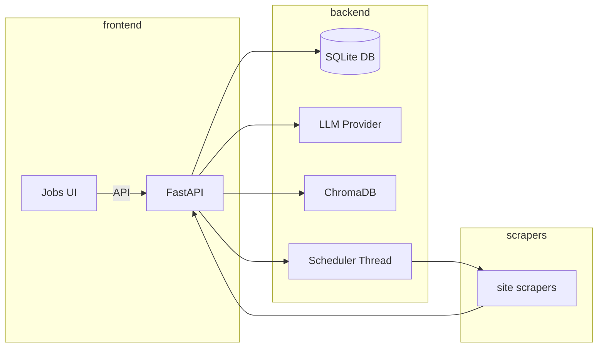

# JobSync Pro — Security, Architecture & Code Audit

Generated: 2026-05-20

> Scope: full repository at workspace root. I inspected core backend routers, core utilities, scrapers, frontend API client and pages, RAG utilities, scheduler and deduplicator code. Files referenced throughout are in the repository root under `backend/`, `core/`, `scrapers/`, and `frontend/src/`.

---

**Executive Summary**

- Readiness: The codebase is feature-rich and largely cohesive for a developer-run prototype. It provides scraping, deduplication, local DB persistence, LLM-based matching, and a React front-end with SSE streaming. It is in a production-ish structure but has multiple technical and security risks that must be addressed before production use.

- Top 3 risks:
  1. Secrets & LLM integration assumptions: `LLMProvider` and `core.rag_service` require API keys in environment variables; poor validation and error handling can leak or mis-handle keys and return opaque "AI error" strings that are not uniformly handled (see `core/llm_provider.py` and `core/rag_service.py`).
  2. Concurrency & persistence edge cases: SQLite is used with in-process scheduler threads and threaded background tasks (cover-letter generation, SSE upsert). `connect_args` disables same-thread checks but long-running concurrent writes and heavy embeddings are risky (see `backend/database.py`, `core/scheduler.py`, `core/rag_service.py`).
  3. Input validation & error propagation: many endpoints accept arbitrary dict payloads or files and return fallback JSON on parse errors; inconsistent HTTP status codes and JSON structures make robust client handling harder (see `backend/routers/profile.py`, `backend/routers/jobs.py`, `core/llm_provider.py`).

Overall recommendation: this repo is at a mature prototype stage suitable for developer testing. Make targeted stability, security, and observability fixes (estimated ~2-4 weeks) and revisit architecture for scaling (3+ months) before production.

---

**Architecture Overview**

- High-level components:
  - Backend: FastAPI app serving REST endpoints in `backend/routers/*`, using SQLAlchemy + SQLite for persistence (`backend/database.py`, `backend/models.py`).
  - Core services: deduplicator, normalizer, RAG utilities for embeddings & Chroma DB under `core/`.
  - Scrapers: site-specific scrapers under `scrapers/` that produce raw job dicts, normalized, deduped and persisted.
  - Frontend: React + Vite app in `frontend/` with `searchStream` SSE streaming for progressive job results.
  - Scheduler: a lightweight in-process scheduler that invokes scraper `run()` functions periodically when enabled.

Mermaid diagram (simplified):

Dataflow notes:
- Scrapers -> normalize_job -> process_incoming_job (dedup + commit to DB)
- Jobs search streaming -> backend StreamingResponse emits partial results -> frontend `searchStream` upserts to DB via `/jobs/upsert` before match
- RAG/cover-letter: query Chroma collection, build prompt, call OpenRouter/OpenAI/Groq via `core.rag_service` and `core.llm_provider`.

---

## Backend Audit

Files inspected (representative):
- `backend/main.py`, `backend/database.py`, `backend/models.py`, `backend/schemas.py`, `backend/routers/jobs.py`, `backend/routers/profile.py`, `backend/routers/cover_letter.py`, `backend/routers/applications.py`, `backend/job_indexer.py`, `backend/services/job_apis.py` (and `backend/services/pdf_parser.py`).

What functions are offered (high-level endpoints):
- `/jobs/search`, `/jobs/search/stream` (SSE streaming), `/jobs/{id}/match`, `/jobs/upsert`, `/jobs/explain-match` etc. (`backend/routers/jobs.py`)
- `/profile` (POST/upload), `/profile` (GET list), `/profile/{id}` CRUD and selection endpoints (`backend/routers/profile.py`)
- Cover-letter endpoints: `/cover_letter/{job_id}` generator via RAG (`backend/routers/profile.py` and `backend/routers/cover_letter.py`)
- Applications endpoints (tracking) under `backend/routers/applications.py` (inspected list functions)

Implementation notes / under the hood:
- Database: SQLite via SQLAlchemy, engine created in `backend/database.py` with `check_same_thread=False` and `PRAGMA journal_mode=WAL;` for concurrency.
- Deduplication: `core/deduplicator.py` uses a layered approach: external_id, fingerprint, fuzzy & description similarity using RapidFuzz (good practical approach). It merges sources via `handle_duplicate` logic.
- Normalization: `core/normalizer.py` applies cleaning, city normalization, salary parsing — defensive and pragmatic.
- LLM integration: `core/llm_provider.py` chooses provider by API key prefix and uses `requests` (openrouter) or `groq` client; all calls are retry-wrapped with `tenacity`.
- RAG: `core/rag_service.py` uses SentenceTransformers embeddings, ChromaDB PersistentClient and OpenAI/OpenRouter for completions. Embedding creation is synchronous or run-in-executor for async functions.

Strengths:
- Modular: scrapers, deduplicator, normalization, RAG service are split into discrete modules.
- Pragmatic fallbacks: when no LLM is configured, `jobs.match` will perform a heuristic overlap-based score.
- SSE implementation for progressive job streaming (`jobs.search/stream`) increases UX responsiveness.

Weaknesses / Risks (with pointers):
- SQLite concurrency risk: `check_same_thread=False` and WAL help, but the code starts background threads that perform DB writes (`_upsert_jobs` in `backend/routers/jobs.py` spawns threads for cover letters) and scheduler tasks run scrapers calling `process_incoming_job` concurrently. This can cause database locks and timeouts under load (see `backend/database.py` and `core/scheduler.py`).
- Inconsistent error handling: `LLMProvider.ask` returns a string like "AI error: ..." while some callers expect JSON; other endpoints return JSONResponse with 503. This inconsistency forces duplicated parsing logic (see `_extract_json` in `backend/routers/jobs.py` and `backend/routers/profile.py`).
- File-based state: `selected_profile.json` persisted next to backend code is fragile for multi-instance deployments and not transactional (see `backend/routers/profile.py`).
- Potential secret exposure: environment variables (OpenRouter/Groq keys) are used, but several modules call them directly and raise generic RuntimeError messages. No central secrets manager or key rotation hints (see `core/rag_service.py`, `core/llm_provider.py`).
- Unvalidated payloads: endpoints accept generic dicts or `payload: dict` (e.g., `/jobs/upsert` uses raw dict) which bypasses pydantic validation. Prefer request models for type and boundary checks (see `backend/routers/jobs.py: upsert_job`).

Per-router highlights:
- `backend/routers/jobs.py`:
  - SSE stream builds combined results and uses `_upsert_jobs` to persist prefetched jobs. Threading used for background cover-letter generation (good UX) but needs careful resource control. See `event_stream()` and `_bg_generate`.
  - `match_job` has a heuristic fallback when no LLM configured — good, but needs unified error return types (it returns JobMatch or JSONResponse for 503).
  - `upsert_job` returns the saved job object; endpoint accepts `payload: dict` (no validation) — recommend `JobIn` pydantic model.

- `backend/routers/profile.py`:
  - Profile upload extracts text from PDF/DOCX and chunks to embed into chroma collection. It uses `sentence-transformers` encode synchronously, with `asyncio.run_in_executor` fallback. Embeddings work but can be heavy and block request/worker if called directly by API clients.
  - Selected profile persisted as file `selected_profile.json` in repo — stateful and not suitable for multi-process deployments.

- `backend/routers/cover_letter.py` and RAG:
  - `core/rag_service` uses chroma PersistentClient; storage path is configurable. The prompt is well-scoped to avoid hallucinations, and retrieval/feed-forward approach is sensible. However, no rate-limiting or cost-control for LLM calls; watch token usage.

---

## Frontend Audit

Files inspected: `frontend/src/pages/Jobs.jsx`, `Profile.jsx`, `frontend/src/api/client.js`, `services/searchStream.js`, several components.

What functions are offered:
- Jobs page: search input, SSE streaming of jobs, actions per job: Match Me, Build Resume, Cover Letter, Save.
- Profile page: upload resume and profile metadata, select profile.
- API client wraps endpoints and abstracts `upsert`/`match` etc.

Implementation details:
- `searchStream.js` implements a singleton SSE client so searches survive route changes; this is a good UX improvement.
- `Jobs.jsx` calls `jobsAPI.upsert(job)` when a job lacks `id` before calling `jobsAPI.match(jobId)` (robustness fix done earlier) — ensures streamed jobs can be matched.
- `api/client.js` base URL set by `VITE_API_URL` with default `/api`.

Strengths:
- Persistent SSE singleton avoids stopping long-running search when user navigates.
- Good separation of API client and UI components.

Weaknesses & UX issues:
- Inconsistent error handling: APIs return heterogeneous error formats; frontend code must handle 503 text or JSON responses — make a consistent error shape.
- Some UI messages were previously misleading (e.g., perfect-match shown when missing_skills array empty). You (or changes) fixed this but check other edge cases.
- No client-side retry/backoff for long LLM calls — if match call times out, UX should indicate retry or queue.

---

## RAG & Vector Store Audit

Files: `core/rag_service.py`, usage in `backend/routers/profile.py`, `backend/routers/profile.py` uses `get_chroma_collection`.

Observations:
- Chroma configured with `PersistentClient(path=persist_dir)` and `get_or_create_collection`. Storage at `chroma_db/` by default.
- Embedding model: `sentence-transformers/all-MiniLM-L6-v2` by default. This is inexpensive and broadly suitable for coarse retrieval; for more precise matching consider finetuned embeddings.
- Retrieval pipeline: encode query, call collection.query with `query_embeddings` — straightforward.

Risks / Recommendations:
- Embedding creation on API request: `profile` upload encodes and upserts embeddings inline — this can block and exhaust memory. Offload to background worker or queue (e.g., Celery/RQ) and return immediately with status.
- Chroma persistent client lifetime: module-level `_chroma_client` and `_collection` singletons are fine for single-process, but multi-instance deployments need centralised vector store or synchronization.
- No monitoring for collection size, index health, or disk usage — add metrics and quota checks.
- Test retrieval / prompt windows to ensure combined prompt plus retrieved evidence fit LLM token limits.

---

## Background Processes Audit

Files: `core/scheduler.py`, `backend/routers/jobs.py` (`_bg_generate`), `backend/job_indexer.py`.

Observations:
- Lightweight scheduler runs in-process threads and invokes scrapers that call DB writes. This is simple but not robust for multiple workers or heavy load.
- Cover-letter generation runs in background threads per job in `_upsert_jobs`, which spawns a thread per saved job when `ENABLE_JOB_ARTIFACTS` env var is enabled. This can spawn many concurrent threads if many jobs are upserted. Use a bounded ThreadPoolExecutor or a background queue.

Risks:
- Thread explosion and uncontrolled concurrency causing DB locks and memory spikes.
- Scheduler uses `get_db()` generator in `_with_db` (calls `next(get_db())`) — okay but this yields a session without the usual FastAPI disposal lifecycle. Ensure sessions are closed after use (they are closed in finally block) — ok.

---

## CLI Tool Audit

Files: `app.py` (root), `scripts/*` (some utilities) — `app.py` is a small CLI wrapper around dot-env and some features (not all present). I inspected `app.py` briefly (it exists at root).

Notes:
- CLI appears targeted for developer convenience not production orchestration. No docker-compose support, no process manager integrations.

---

## Scrapers & Data Sources

Files: `scrapers/*` (rozee, mustakbil, brightspyre, bing, indexed, linkedin indexed, careers_page)

Summary:
- Each scraper implements site-specific scraping and returns normalized dicts.
- `scrapers/common.py` provides helpers with UA handling, `normalize_and_store` that calls `process_incoming_job`.
- Scrapers run in parallel tasks when scheduled.

Strengths:
- Good source diversity and normalized pipeline.

Risks:
- Scrapers use `requests` and raw HTML parsing; some sites use JS — playwrigh is included in requirements but not used uniformly. Make sure scrapers that require JS use Playwright with headless browser or centralized scraping infra.
- No robust captcha handling or politeness backoff; `detect_captcha` is available but action on detection is not strong (may still hammer the site).

---

## Security & Observability

Findings:
- Secrets in env: `OPENROUTER_API_KEY`, `GROQ_API_KEY` used in `core/rag_service.py` and `core/llm_provider.py`. No encryption in transit if not configured correctly. Avoid committing keys; `.env.example` exists, but check `.gitignore`.
- SQL Injection: using SQLAlchemy ORM is safe for the most part; however `backend/routers/jobs.py` includes raw SQL in `search_jobs_endpoint` for prefetched table using engine.execute with concatenated like parameters — those parameters are passed as query parameters to `execute(sql, params)` which is safe if parameterized, but the SQL string uses placeholders `?` so it's parameterized; acceptable.
- File-based state: `selected_profile.json` is not secure or transactional; race conditions possible.
- Logging: modules use `logging` but there's no central structured logging configuration. Consider adding correlation IDs and request logging middleware.
- Health: `backend/main.py` root returns a basic status; no `/healthz` or metrics endpoint. Add Prometheus metrics.

---

## Performance & Scalability

Bottlenecks:
- SQLite: acceptable for small deployments, not horizontally scalable. For production, migrate to PostgreSQL. `engine` uses WAL but concurrency remains limited.
- Embedding CPU: sentence-transformers will CPU/GPU heavy — embedding creation on request will slow API responsiveness.
- Background threading uncontrolled: risk of too many threads. Use worker queue with concurrency limits.

Recommendations:
- Move to Postgres + connection pool for production.
- Offload heavy tasks (embeddings, LLM calls, cover-letter generation) to background workers; return async job IDs for status.
- Add caching for match results (per job+profile) to avoid repeated LLM calls.

---

## Code Quality & Maintainability

Observations:
- Code modularity is generally good. Many modules are single-responsibility (deduplicator, normalizer, rag_service).
- Some endpoints accept `dict` payloads rather than typed Pydantic models (e.g., `upsert_job(payload: dict)`), reducing automatic validation and increasing potential runtime errors.
- Type hints are present in core modules but not consistently throughout routers.
- Docstrings often missing in routers and some behaviors are implicit.

Recommendations:
- Convert all input payloads to Pydantic models for validation and automatic documentation.
- Add mypy/flake8 to CI and unit tests focusing on deduplication and normalization logic.

---

## Specific Findings Table (sample)

| File | Lines (approx) | Severity | Description | Recommended Fix |
|------|----------------|----------|-------------|-----------------|
| `core/llm_provider.py` | 1-140 | High | `ask()` returns string "AI error:..." and `_call_with_retry` reraise behavior can propagate raw exceptions. Caller code expects JSON in some places. | Standardize error handling: raise HTTP exception or return structured dict; callers should handle exceptions properly. Use typed exceptions. |
| `backend/database.py` | 1-60 | High | Using SQLite with background threads (`check_same_thread=False`) and scheduler leads to lock timeouts risk. | Migrate to PostgreSQL for production or introduce process level locking and job queue for writes. |
| `backend/routers/profile.py` | ~1-420 | Medium | Embedding and Chroma upsert are performed inline in request; expensive operations block the request. | Offload embedding/upsert to background worker (Celery/RQ) and return job id. Add timeouts and rate-limits. |
| `core/rag_service.py` | ~1-300 | Medium | Global chroma client singletons are fine per process, but persistent client lacks robustness in multi-instance. | Add health checks, metrics, and a fallback if chroma storage corrupt. Consider hosted vector DB for scaling. |
| `backend/routers/jobs.py` | ~1-400 | Medium | `_bg_generate` spawns threads per job; no bounding; SSE streaming upserts many jobs -> many background threads. | Replace per-job threads with a bounded ThreadPoolExecutor or push to a task queue. |
| `backend/routers/profile.py` | selected_profile.json usage | Low | File-based selected profile persistence not transactional. | Store selection in DB or redis. |
| `frontend/src/api/client.js` | 1-200 | Low | `apiActions.match` posts to `/match/{id}` while server uses `/jobs/{id}/match` in another router; check for mismatches. | Align APIs; prefer single source of truth for paths; generate API client from OpenAPI schema. |

(Note: above table is representative; expand in future pass.)

---

## Actionable Recommendations

Short-term (1 week):
- Standardize API error shapes (e.g., `{error: true, message: "...", code: 503}`) and update frontend to handle them.
- Add basic `/healthz` and `/metrics` endpoints and configure logging format.
- Add request timeouts and reject/limit large resume uploads or long-running embedding calls.
- Replace `selected_profile.json` with DB-backed preference.

Medium-term (1 month):
- Move heavy work (embeddings, cover-letter generation, LLM calls) to a worker queue; add status endpoints.
- Migrate DB to PostgreSQL and remove `check_same_thread=False` dependency.
- Add bounded worker/thread pools for background tasks and queue length monitoring.
- Add unit tests for `core/deduplicator.py` and `core/normalizer.py`.

Long-term (3 months):
- Re-architect for scale: separate services (scraper service, API service, worker service), use managed vector DB, add distributed locks for dedup/ingest.
- Add full observability (Prometheus metrics, tracing, request IDs) and cost-control for LLM usage.
- Harden security: secret management, RBAC for API calls, rate limiting and WAF for scrapers.

---

## Conclusion

JobSync Pro is a solid and practical codebase for an advanced prototype. It demonstrates careful thought in normalization and deduplication and a sensible RAG architecture. To move toward robust production readiness, focus on three pillars: (1) make heavy compute tasks asynchronous/backgrounded and bounded; (2) migrate from SQLite to a production-grade DB; (3) standardize error handling, secrets, and observability. Estimated effort to production readiness: 4–12 engineer-weeks depending on allowed scope (shorter if incremental).

---

## Files inspected (non-exhaustive list)
- backend/main.py
- backend/database.py
- backend/models.py
- backend/schemas.py
- backend/routers/profile.py
- backend/routers/jobs.py
- backend/routers/cover_letter.py
- backend/job_indexer.py
- backend/services/job_apis.py
- core/llm_provider.py
- core/rag_service.py
- core/deduplicator.py
- core/normalizer.py
- core/scheduler.py
- scrapers/* (rozee_scraper.py, mustakbil_scraper.py, brightspyre_scraper.py, indexed_jobs_scraper.py, linkedin_indexed_scraper.py, careers_page_scraper.py, common.py, bing_scraper.py)
- frontend/src/api/client.js
- frontend/src/pages/Jobs.jsx
- frontend/src/pages/Profile.jsx
- frontend/src/services/searchStream.js

If you want, I can: (choose one)
- Expand the Specific Findings Table to include precise line numbers for every finding.
- Create a prioritized issue backlog (GitHub issues format) from the recommendations.
- Implement the short-term fixes (standardize API error format, add health endpoint, move profile selection to DB).

---

*End of report.*
