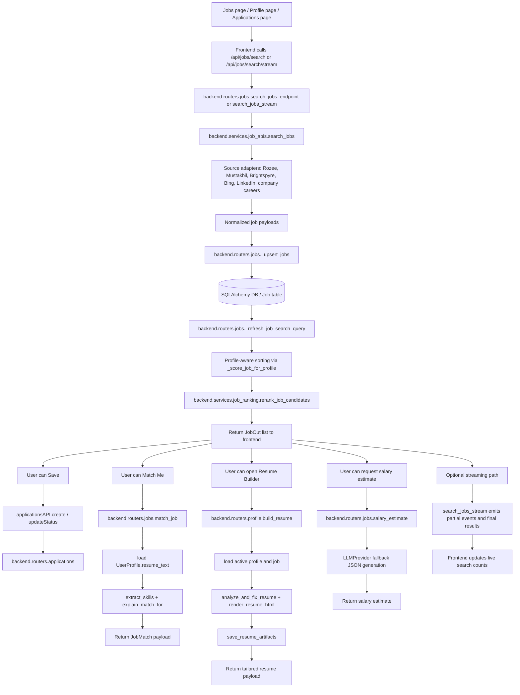
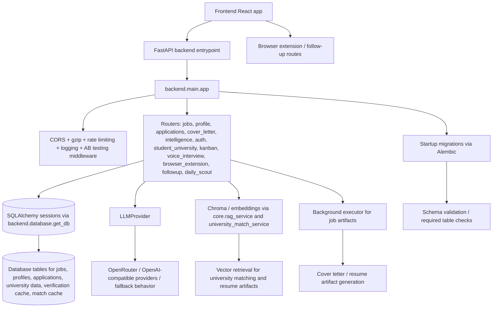

# Workflow Diagrams

This document captures the implemented request flows for the job and university modules, plus shared infrastructure that supports both.

## 1) Job Module workflow



### Notes

- The job search endpoint uses live fetches and then persists results so the DB can be reused for subsequent searches.
- The job ranking path combines profile-aware heuristics and optional cross-encoder reranking through [backend/services/job_ranking.py](backend/services/job_ranking.py).
- Resume tailoring is implemented in [backend/routers/profile.py](backend/routers/profile.py) and uses resume analysis, HTML rendering, and artifact saving.

## 2) University Module workflow

```mermaid
flowchart TD
    A[StudentProfileForm / StudentUniversitySearch / UniversityMatchList / SavedUniversities page] --> B[Frontend calls /api/student/profile, /api/student/universities/filter, /api/student/match/recommend, /api/student/verify/{id}/{program_id}, /api/student/save, /api/student/apply]
    B --> C[backend.routers.student_university.api_router]
    C --> D[Student profile CRUD]
    D --> E[(SQLAlchemy DB / student_profiles and user_preferences)]

    C --> F[GET /universities/filter]
    F --> G[Query University + Program data]
    G --> H[Return university/program payloads]

    C --> I[POST /match/recommend]
    I --> J[backend.services.university_match_service.retrieve_similar_programs]
    J --> K[Heuristic vector-style ranking across Program + University rows]
    K --> L[backend.services.university_match_service.get_match_for_program]
    L --> M{Cached match exists?}
    M -->|Yes| N[Return cached StudentProgramMatch]
    M -->|No| O[Load verification data if enabled]
    O --> P[backend.services.university_verification_service.verify_program_live]
    P --> Q[SearXNG + parsing + cache update]
    Q --> R[LLMProvider-powered match analysis fallback]
    R --> S[Persist StudentProgramMatch]
    S --> T[Return match payload]

    C --> U[GET /verify/{university_id}/{program_id}]
    U --> V[Resolve selected student profile]
    V --> W[verify_program_live]
    W --> X[Cache hit or live fetch + heuristics]
    X --> Y[Return verification payload]

    C --> Z[POST /save]
    Z --> AA[Create SavedProgram]
    AA --> AB[Return saved payload]

    C --> AC[POST /apply]
    AC --> AD[Create/update StudyApplication]
    AD --> AE[Return application payload]

    C --> AF[GET /applications/{student_id}]
    AF --> AG[Return saved applications]
```

### Notes

- Profile management and selection are handled in [backend/routers/student_university.py](backend/routers/student_university.py).
- Program recommendations use a combination of heuristic scoring and verification-aware analysis in [backend/services/university_match_service.py](backend/services/university_match_service.py).
- Live verification uses SearXNG plus cache-backed fallbacks in [backend/services/university_verification_service.py](backend/services/university_verification_service.py).

## 3) Shared infrastructure



### Notes

- The API bootstraps core middleware and routers in [backend/main.py](backend/main.py).
- Shared infrastructure includes authentication, logging, rate limiting, startup migrations, and provider fallback logic.
- The job and university flows both depend on the same API and persistence layer, but their recommendation logic is separated into dedicated services.
